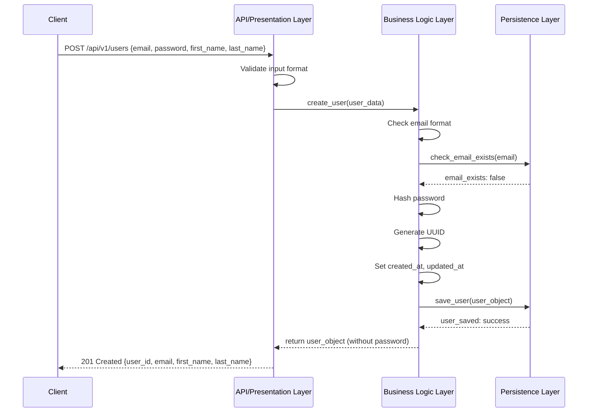
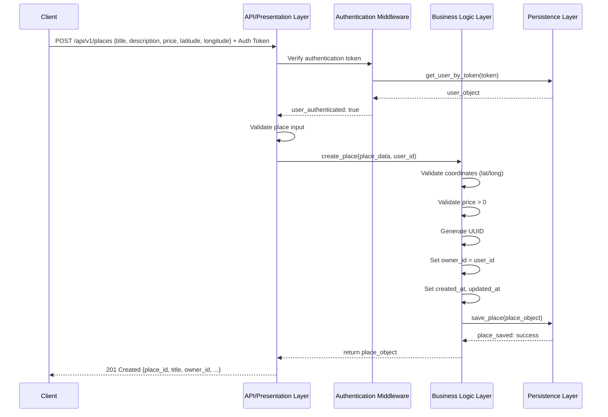
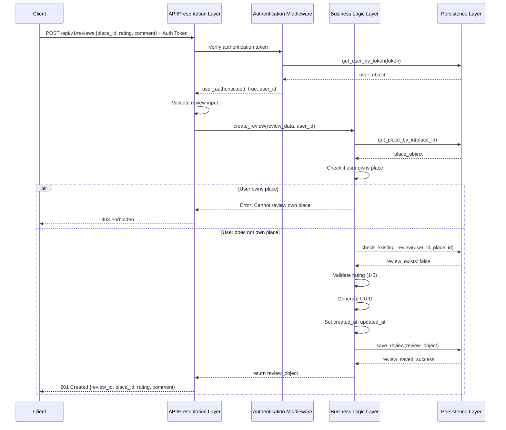
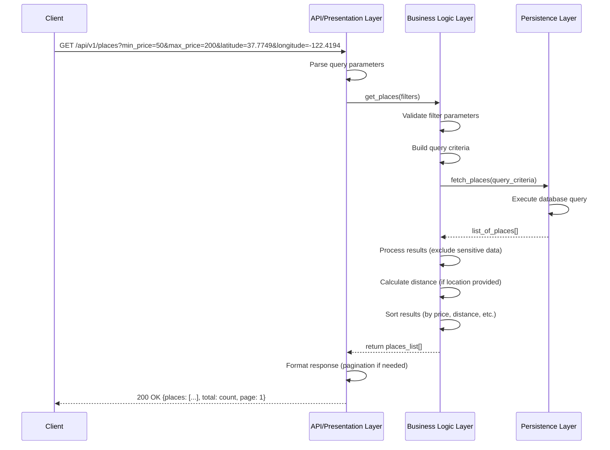

# Sequence Diagrams for API Calls

## Overview
This document presents sequence diagrams for four key API calls in the HBnB application, illustrating the interaction flow between the Presentation Layer, Business Logic Layer, and Persistence Layer.

---

## 1. User Registration

### Description
When a new user signs up for an account, the system must validate the user's information, ensure email uniqueness, hash the password, and store the user data in the database.

### Sequence Diagram

### Key Steps
1. **Input Validation**: API validates the request format
2. **Email Uniqueness Check**: Business Logic checks if email already exists
3. **Password Security**: Password is hashed before storage
4. **User Creation**: User object is created with UUID and timestamps
5. **Persistence**: User data is saved to database
6. **Response**: User details (excluding password) are returned to client

### Error Scenarios
- **400 Bad Request**: Invalid input format
- **409 Conflict**: Email already exists
- **500 Internal Server Error**: Database error

---

## 2. Place Creation

### Description
An authenticated user creates a new place listing. The system validates the user's authentication, processes place data, associates it with the owner, and stores it in the database.

### Sequence Diagram

### Key Steps
1. **Authentication**: Verify user identity via token
2. **Authorization**: Confirm user can create places
3. **Input Validation**: Validate place details (price, coordinates)
4. **Place Creation**: Generate UUID and associate with owner
5. **Persistence**: Save place to database
6. **Response**: Return created place details to client

### Error Scenarios
- **401 Unauthorized**: Invalid or missing authentication token
- **400 Bad Request**: Invalid input (negative price, invalid coordinates)
- **500 Internal Server Error**: Database error

---

## 3. Review Submission

### Description
An authenticated user submits a review for a place. The system validates that the user is not reviewing their own place, checks for duplicate reviews, validates the rating, and stores the review.

### Sequence Diagram

### Key Steps
1. **Authentication**: Verify user identity
2. **Place Validation**: Confirm place exists
3. **Ownership Check**: Ensure user is not reviewing their own place
4. **Duplicate Check**: Verify user hasn't already reviewed this place
5. **Rating Validation**: Ensure rating is between 1-5
6. **Review Creation**: Generate UUID and timestamps
7. **Persistence**: Save review to database
8. **Response**: Return review details to client

### Error Scenarios
- **401 Unauthorized**: Invalid or missing token
- **403 Forbidden**: User attempting to review own place
- **404 Not Found**: Place does not exist
- **409 Conflict**: User already reviewed this place
- **400 Bad Request**: Invalid rating (not 1-5)

---

## 4. Fetching a List of Places

### Description
A client requests a list of places based on optional filters (e.g., price range, location). The system retrieves matching places from the database and returns them to the client.

### Sequence Diagram

### Key Steps
1. **Query Parsing**: Extract and validate filter parameters
2. **Criteria Building**: Construct database query based on filters
3. **Data Retrieval**: Fetch matching places from database
4. **Data Processing**: 
   - Remove sensitive information
   - Calculate distances if location filters provided
   - Sort results based on criteria
5. **Pagination**: Apply pagination if needed
6. **Response**: Return formatted list to client

### Supported Filters
- **Price Range**: `min_price`, `max_price`
- **Location**: `latitude`, `longitude`, `radius`
- **Amenities**: `amenity_ids[]`
- **Pagination**: `page`, `limit`

### Error Scenarios
- **400 Bad Request**: Invalid filter parameters
- **500 Internal Server Error**: Database query error

---

## Layer Responsibilities Summary

### Presentation Layer (API)
- Receives and validates HTTP requests
- Handles authentication/authorization
- Formats responses
- Manages HTTP status codes
- Handles errors and exceptions

### Business Logic Layer
- Implements business rules and validations
- Processes data transformations
- Manages entity relationships
- Enforces constraints (uniqueness, ownership, etc.)
- Coordinates between API and Persistence layers

### Persistence Layer (Database)
- Stores and retrieves data
- Ensures data integrity
- Executes queries
- Manages transactions
- Returns data to Business Logic layer

---

## Common Patterns Across All API Calls

1. **Input Validation**: Every API call validates input at multiple layers
2. **Authentication/Authorization**: Protected endpoints verify user identity
3. **UUID Generation**: All entities receive unique identifiers
4. **Timestamps**: All entities track creation and update times
5. **Error Handling**: Each layer handles and propagates errors appropriately
6. **Data Sanitization**: Sensitive data (passwords, tokens) excluded from responses

---

## Notes
- All sequence diagrams follow the standard flow: Client → API → Business Logic → Database
- Error handling paths are illustrated where critical business rules apply
- Authentication is handled by middleware before reaching business logic
- Database operations are abstracted to allow for different persistence implementations
- Response codes follow HTTP standards (200, 201, 400, 401, 403, 404, 409, 500)
